# GWSW-Hyd

De module GWSW-Hyd is ontwikkeld door Jordie Netten (Stichting Rioned/Netten Wateradvies), in samenwerking met de werkgroep GWSW-Hyd, bestaande uit:
- Marco van Bijnen (Van Bijnen Advies)
- Katrin Boden, Guido Vaes en Ilse Bisson (Inneautech, Hydroscan, Infoworks ICM)
- Arthur van Dam en Didrik Meijer (Deltares, D-Hydro)
- Hendrik Kingma (Riodesk)
- Peter van der Kruk (Waternet)
- Thijs Nix (Tauw)
- Perry Pijnappels (Kragten)
- Frank Ramaekers (Gemeente Helmond)
- Arnold van 't Veld en Jonas van Schrojenstein Landman (Nelen & Schuurmans, 3Di)
- Sjaak Verkerk (Antea Group)
- Johan Veurink (Arcadis)
- Marinus Vonhof (Stichting RIONED/marIvon)
- Wouter van Riel (Stichting RIONED/Infralytics)

Vanuit Stichting RIONED is Eric Oosterom de verantwoordelijk projectmanager. Vragen over de module en de totstandkoming en vaststelling ervan kunt u stellen via gwsw@rioned.org. 

Gelieve de inhoudsopgave als leeswijzer te beschouwen.

# Inleiding
voor de uitwisseling van informatie ten behoeve van het uitvoeren van hydraulische berekeningen werd tot 2020 het SUF-HYD (Standaard UitwisselingsFormaat Hydraulische gegevens) van rioolstelsels gebruikt. De rioleringspraktijk vroeg al lang om een actualisatie, die dankzij de ontwikkeling van het GegevensWoordenboek Stedelijk Water heeft geleid tot het GWSW-Hyd. Het GWSW-Hyd beschrijft de ontologie (hoe iets heet) en het datamodel (wat de verbanden zijn tussen die dingen) van de objecten en bijbehorende kenmerken die relevant zijn voor hydraulische berekeningen van rioolstelsels. 

## Gegevensstromen en gereedschappen rond het GWSW

Nu al worden door veel gemeenten en waterschappen de gegevens van rioolstelsels op de GWSW Server gepubliceerd. Deze gegevens komen 1) via de upload functionaliteit van de GWSW Server middels een OroX (.ttl) bestand vanuit het gemeentelijke beheerpakket of 2) via het GegevensKnooppunt Waterschappen (Het Waterschapshuis) terecht in de dataomgeving van de betreffende organisatie op de GWSW Server. 

De module GWSW-Hyd ondersteunt in de gegevensuitwisseling voor het maken van hydraulische berekeningen in het vrijverval stelsel van de riolering. Het is dus van belang dat de OroX (die vanuit het gemeentelijke rioleringsbeheerpakket komt) deze gegevens conform het datamodel GWSW-Hyd bevat. 

Op de GWSW-server worden de gegevens van de verschillende organisaties opgeslagen. Met de applicatie 'Download Hydx' kan er van de dataset op de GWSW-server een uitwisselbestand (GWSW.hydx) wordt aangemaakt en worden gedownload. 

In Figuur 2 staan de gegevensstromen en gereedschappen weergegeven die gebruikt worden voor het maken van hydraulische berekeningen met GWSW-Hyd.

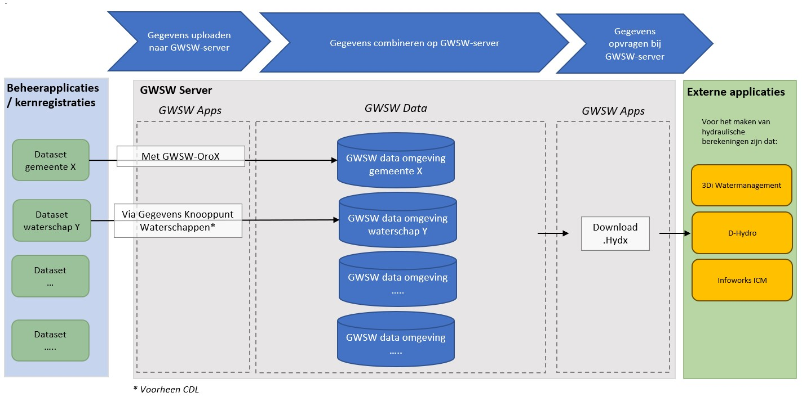

*Figuur 2 - Gegevensstromen en gereedschappen voor het maken van hydraulische berekeningen*  

# Datamodel GWSW-Hyd

## Algemeen
De benodigde informatie voor de uitwisseling van informatie over de riolering wordt samengevat in meerdere .CSV bestanden die tezamen het GWSW.hydx vormen. Deze bestanden zijn gebaseerd op de onderstaande informatiecategorieën:
- Netwerk
- Belasting
- Meta-informatie

Hieruit komen de volgende .CSV bestanden voort:
- KNOOPPUNT.csv
- VERBINDING.csv
- KUNSTWERK.csv
- OPPERVLAK.csv
- DEBIET.csv
- META.csv

In de bovenstaande .CSV bestanden kan worden verwezen naar de onderstaande definities, die als losse .CSV bestanden (kunnen) worden bijgevoegd:
- ITOBJECT.csv
- PROFIEL.csv
- NWRW.csv
- VERLOOP.csv

Ter ondersteuning zijn conditionele voorwaarden en domeintabellen opgenomen in het GWSW-Hyd. In de .CSV bestanden is er ruimte voor het opnemen van meta-informatie van objecten, toelichting per record en aannames ten behoeve van de modellering. Het GWSW.hydx bevat een uitgebreide set mogelijkheden om gegevens ten behoeve van het uitvoeren van
hydraulische berekeningen uit te wisselen. Het formaat is flexibel zodat het mogelijk is om nieuwe definities toe te voegen en domeintabellen uit te breiden. Dit maakt het formaat toekomstbestendig.

## Netwerk
In het GWSW-Hyd wordt uitgegaan van een netwerkconcept, waarin onderlinge relaties en definities staan beschreven. Een netwerk bestaat uit knooppunten en verbindingen, die allen zijn voorzien van een unieke ID (UNI_IDE). In KNOOPPUNT.CSV staat de fysieke ligging en kenmerken van knooppunten beschreven. In VERBINDING.CSV staat
beschreven welke knooppunten op welke manier zijn verbonden en welke condities daaraan zijn verbonden. Meervoudige verbindingen krijgen per verbinding een unieke ID. Knooppunten en verbindingen hebben unieke eigenschappen die in andere .CSV bestanden worden toegekend aan de unieke ID (zie het [Voorbeeld Knooppunt](#knooppunt) of [Voorbeeld Verbinding](#verbinding)).

## Kunstwerken
Een kunstwerk kan een knooppunt of een verbinding zijn. Binnen het GWSW-Hyd wordt voorgesorteerd op de meest gangbare kunstwerken in de riolering, te weten pomp, overstortdrempel, doorlaat en uitlaat. De domeintabellen bieden ruimte voor uitbreidingen hierop. In KNOOPPUNT.CSV wordt in het veld KNP_TYP aangegeven als het om een
uitlaat gaat. In VERBINDING.CSV wordt in het veld VRB_TYP aangegeven om welk kunstwerk (pomp, overstort, doorlaat) het gaat. Een gemaalpomp, een doorlaat en een overstortdrempel zijn altijd een verbinding. Een uitlaat is altijd een knooppunt.

In KUNSTWERK.CSV wordt per unieke ID in het veld KWK_TYP opgenomen welk type kunstwerk het is. Vervolgens moet er per type kunstwerk een aantal verplichte waarden worden gedefinieerd (zie de [Voorbeelden bij Kunstwerken](#kunstwerken)). Zo heeft een pomp o.a. een aan- en afslagpeil en heeft een overstortdrempel o.a. een drempelhoogte en -breedte. In KUNSTWERK.CSV kunnen ook specifieke Qh-relaties worden toegekend. Dit gebeurt in de velden QDH_NIV en QDH_DEB, waar de waarden getabuleerd kunnen worden opgegeven, met spatie als separator.

Met het netwerkconcept is het mogelijk om een compartimenteerde put op te nemen in het uitwisselformaat. Ieder compartiment krijgt een unieke ID, en daardoor ook eigen kenmerken toegekend. De verbinding tussen de compartimenten wordt ook gedefinieerd (zie het [Voorbeeld bij Gecompartimenteerde put](#compartiment)).

## Belasting
De belasting op een rioleringsstelsel heeft een neerslagcomponent (RWA) en afvalwatercomponent (DWA). Dit kan als directe belasting of als indirecte belasting (ook wel lateraal debiet genoemd) aan de schematisatie worden toegekend. 

### Neerslag
De directe neerslagcomponent wordt bepaald door het aangesloten oppervlak dat is opgenomen in OPPERVLAK.CSV gekoppeld aan een neerslag-afvoerconcept. In GWSW.hydx is het NWRW-inloopmodel als 0D neerslag-afvoerconcept standaard opgenomen. Andere concepten kunnen in de toekomst worden toegevoegd, maar zullen vermoedelijk in het
2D-terreinmodel worden opgelost. In OPPERVLAK.CSV wordt per unieke ID (knooppunt of verbinding) aangegeven hoeveel vierkante meter (AFV_OPP) er via welk concept (AFV_DEF) met welke kenmerken (AFV_IDE) op afstroomt. Per unieke ID kunnen meerdere neerslagafvoerconcepten en specifieke kenmerken worden opgenomen door meerdere records van dat unieke ID op te nemen
(zie het [Voorbeeld bij Oppervlak](#oppervlak)).

### Vuilwater en lateraal debiet
De afvalwatercomponent wordt bepaald door belasting op een unieke ID (knooppunten en verbindingen) vanuit (directe) pandaansluitingen en (indirecte) laterale debieten (Paragraaf 4.5). In DEBIET.CSV wordt per unieke ID in het veld DEB_TYP aangegeven wat het debiettype is. Dit kan alleen vuilwater zijn (VWD) of een lateraal debiet met
vuilwater en/of oppervlak (LAT). Denk bij dat laatste aan inprikkers van drukriolering, de inprik van een ‘bakjesmodel’ of een proceswaterlozing.

Als het alleen vuilwater is of een lateraal debiet met vuilwater, dan moet in DEBIET.CSV het aantal vervuilingseenheden (AVV_ENH) worden opgegeven. Als het een lateraal debiet is met verhard oppervlak, dan moet in DEBIET.CSV het afvoerend oppervlak worden opgegeven (in veld AFV_OPP). Bij een lozing van bijvoorbeeld proceswater hoeft het aantal vervuilingseenheden en het afvoerend oppervlak niet te worden opgegeven.

In het veld VER_IDE van DEBIET.CSV wordt verwezen naar de verloopdefinitie die in VERLOOP.CSV is opgenomen. Het GWSW.hydx biedt mogelijkheden voor constant en variabel verloop over de week en over de dag. Per unieke verloopdefinitie (VER_IDE) moet er in VERLOOP.CSV één record worden opgenomen. In het veld VER_TYP wordt het verlooptype aangegeven met de opties:
- DAG – Variabel debiet per uur met vast dagvolume
- CST – Constant debiet per uur met variabel dagvolume
- VAR – Variabel debiet per uur met variabel dagvolume

Zie het [Voorbeeld bij Vuilwater en Lateraal debiet](#dwa).

## Meta-informatie
Het bestand META.CSV bevat alle relevante meta-informatie behorende bij het uit te wisselen GWSW.hydx. Denk hierbij aan het aantal .CSV bestanden dat bij het GWSW.hydx behoort, zodat de volledigheid te controleren is, maar ook aan de vermelding van de opdrachtgever, de uitvoerende, enzovoort

## Extra ondersteunende definities
Een verbinding kan een leiding of kunstwerk zijn. Dit wordt gedefinieerd in het veld VRB_TYP. Afhankelijk hiervan kunnen er losse profieldefinities (in PROFIEL.CSV voor VRB_TYP=GSL, OPL, ITR of DRL) en vervolgens eventueel ook definities voor infiltratie (in ITOBJECT.CSV voor VRB_TYP=ITR) worden opgegeven.

In PROFIEL.CSV wordt in veld PRO_VRM gedefinieerd welke vorm het profiel heeft. Dit kunnen vaste vormen zijn, zoals rechthoekig of rond. Dit kunnen ook afwijkende vormen zijn. Voor profielen in open water dient gekozen te worden voor XY-profielen (XYP). Voor gesloten profielen dient gekozen te worden voor ‘tabulated’ profielen (TAB). In de bijbehorende waardevelden (TAB_BRE en TAB_HGT) worden de waarden opgegeven met een spatie als separator. Zie het [Voorbeeld bij Profiel](#profiel)).

# Voorbeelden

## Knooppunt en Verbinding
Om een voorbeeld van KNOOPPUNT.CSV en VERBINDING.CSV te geven wordt het onderstaande ‘stelsel’ gebruikt (Figuur 3):

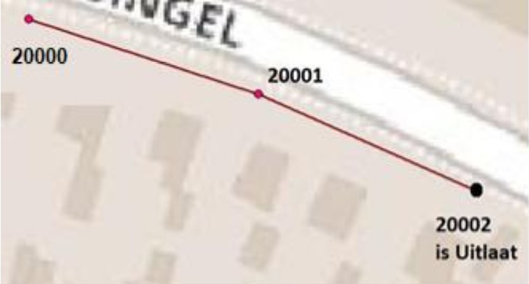

*Figuur 3 - Voorbeeldstelsel A*  

Het KNOOPPUNT.CSV van ‘Voorbeeldstelsel A’ bevat drie records (Tabel 1). 

*Tabel 1 - KNOOPPUNT.CSV*  
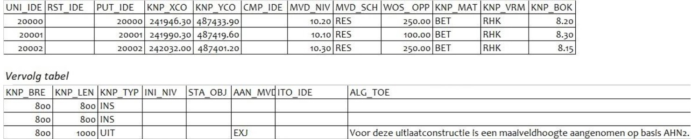

Het VERBINDING.CSV van ‘Voorbeeldstelsel A’ bevat twee records (Tabel 2).

*Tabel 2 - VERBINDING.CSV*  

## Kunstwerken

Knooppunten en verbindingen kunnen ook kunstwerken zijn. Hieronder een voorbeeld van op welke wijze kunstwerken kunnen worden opgenomen in GWSW.hydx. Aandachtspunten hierbij zijn:
- In het GWSW.hydx worden de pompen als losse kunstwerken gezien (dus niet als gemaal)
- Indien een gemaal twee pompen in samenloop heeft werken, dan zijn dat twee verbindingen (zie voorbeeld)
- Indien een gemaal twee pompen alternerend heeft werken, dan is dat één verbinding
- Een gemaalpomp, een doorlaat en een overstortdrempel zijn altijd een verbinding. Een uitlaat is altijd een knooppunt.

N.B. In VERBINDING.CSV (Tabel 3) en KUNSTWERK.CSV (Tabel 4) worden knooppunten benoemd. De bijbehorende KNOOPPUNT.CSV is niet opgenomen in dit document.
N.B. Een terugslagklep kan worden geschematiseerd door de stromingsrichting van een verbinding te definiëren.

*Tabel 3 - VERBINDING.CSV*  
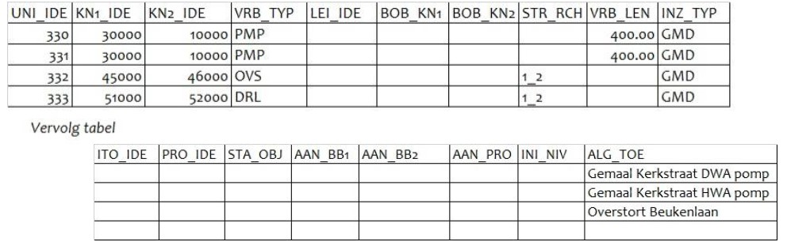

*Tabel 4 - KUNSTWERK.CSV*  
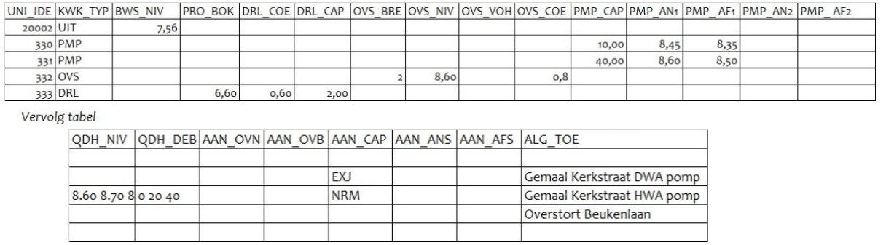

## Bijzondere constructies

### Gecompartimenteerde put
Om een voorbeeld van KNOOPPUNT.CSV, VERBINDING.CSV en KUNSTWERK.CSV te geven wordt het onderstaande ‘stelsel’ gebruikt (Figuur 4). 

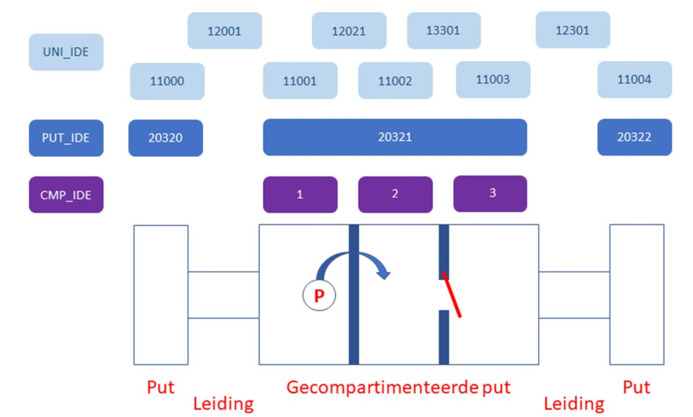

*Figuur 4 - Voorbeeldstelsel B*  

Het KNOOPPUNT.CSV (Tabel 5) van ‘Voorbeeldstelsel B’ bevat vijf records (11000, 11001,11002, 11003, 11004).

*Tabel 5 - KNOOPPUNT.CSV*  
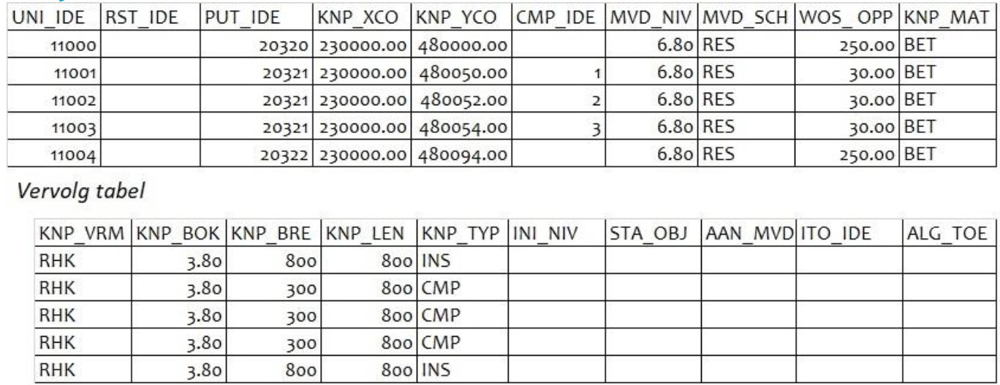

Het VERBINDING.CSV (Tabel 6) van ‘Voorbeeldstelsel B’ bevat vier records (12001, 12021, 13301, 12301).

*Tabel 6 - VERBINDING.CSV*  
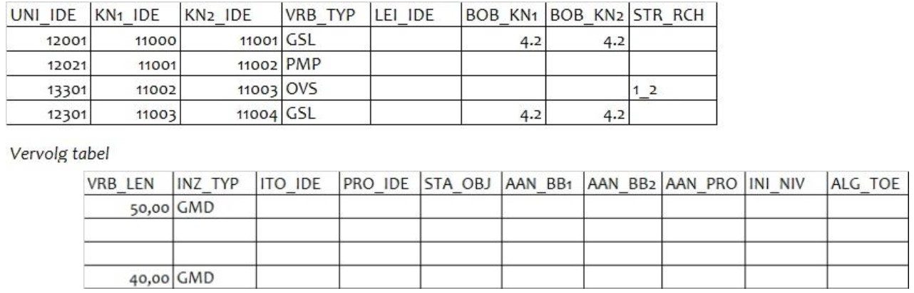

Het KUNSTWERK.CSV (Tabel 7) van ‘Voorbeeldstelsel B’ bevat twee records (12021 en 13301).

*Tabel 7 - KUNSTWERK.CSV*  
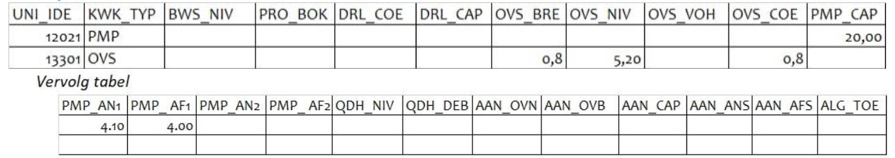

Noot: Als een compartiment tevens een uitlaat is, dan komt ‘uitlaat’ boven ‘compartiment’ in de prioritering bij KNP_TYP.

## Oppervlak
Om een voorbeeld van OPPERVLAK.CSV (Tabel 8) te geven wordt ‘Voorbeeldstelsel A’ gebruikt (Figuur 3). Oppervlak kan worden toegekend aan knooppunten en aan verbindingen. In het voorbeeld wordt gebruik gemaakt van het NWRW neerslag-afvoermodel.

*Tabel 8 - OPPERVLAK.CSV*  
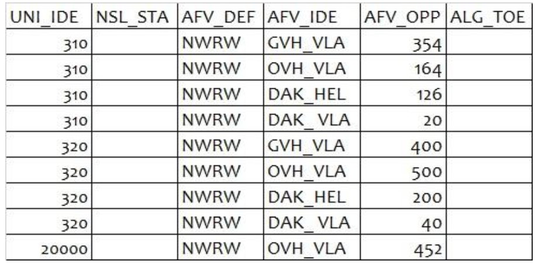

Let op: Het is in het uitwisselformaat mogelijk om meerdere neerslag-afvoerconcepten te gebruiken op één UNI_IDE. Dit is (nog) niet of beperkt in de modelinstrumentaria mogelijk.
Let op: Het is aan de modelleur om ervoor zorg te dragen dat oppervlak op de ‘juiste’ verbindingen terecht komt. Met andere woorden: Sluit geen oppervlak aan op kunstwerken zoals gemalen, overstorten en doorlaten

## Vuilwater en lateraal debiet
Om een voorbeeld van DEBIET.CSV (Tabel 9) en VERLOOP.CSV (Tabel 10) te geven wordt ‘Voorbeeldstelsel A’ gebruikt (Figuur 3). Vuilwater (VWD) of lateraal debiet met afvalwater en/of oppervlak (LAT) kan worden toegekend aan knooppunten en aan verbindingen. Bij een lateraal debiet met oppervlak worden geen neerslag-afvoerprocessen beschreven. Met andere woorden: Alle neerslag dat op het oppervlak landt, komt direct als debiet op de UNI_IDE.

*Tabel 9 - DEBIET.CSV*  
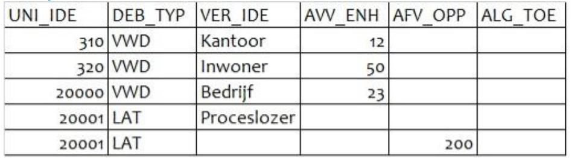

*Tabel 10 - VERLOOP.CSV*  
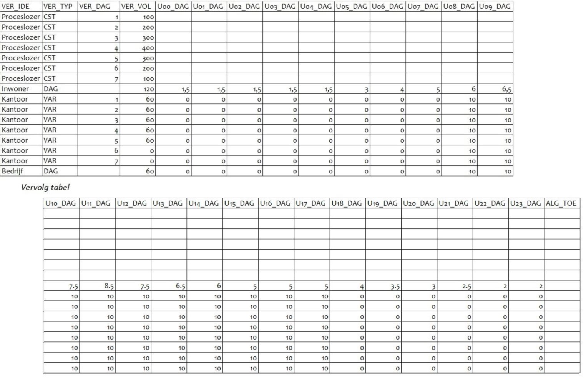

Let op: Het is in het uitwisselformaat mogelijk om meerdere verlopen op één UNI_IDE te zetten. Dit is (nog) niet in alle modelinstrumentaria mogelijk.
Let op: Het is aan de modelleur om ervoor zorg te dragen dat DWA en lateraal debiet op de ‘juiste’ verbindingen terecht komt. Met andere woorden: Sluit geen afvalwater aan op kunstwerken zoals gemalen, overstorten en doorlaten.

## Profiel
In PROFIEL.CSV zijn de standaardvormen van leidingprofielen reeds opgenomen. Daaraan kunnen nieuwe profielen worden toegevoegd. In Tabel 11 staat een voorbeeld weergegeven, waarin ook tabulated en yz-profielen zijn opgenomen.

*Tabel 11 - PROFIEL.CSV*  
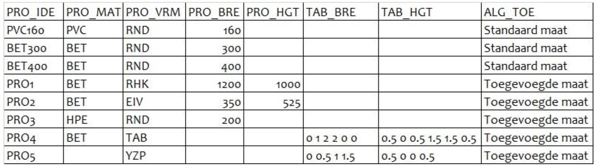

# Testbestand

## Inleiding
Om de implementatie van het GWSW-Hyd en het .hydx technisch te faciliteren stelt Stichting RIONED een testbestand beschikbaar. Het testbestand volgt het gegevensmodel GWSW-Hyd. In dit testbestand zijn alle velden die voorkomen in het .hydx uitwisselformaat tenminste één keer voorzien van een waarde en worden alle mogelijke domeinwaarden tenminste één keer toegepast. Daarmee is dit testbestand geschikt om software te testen op conformiteit aan het uitwisselformaat. In deze paragraaf staat de opbouw van het testbestand beschreven.

## Globale opbouw

Het testbestand beschrijft een combinatie van fictieve rioolstelsels met daarin een diversiteit aan hydraulisch relevante constructies en belastingen op het stelsel. Met het samenstellen van het testbestand is enkel het doel van het testen van gegevensuitwisseling conform het .hydx uitwisselformaat beschouwd. Het testbestand staat schematisch
weergegeven in Figuur 5 en staat als orox bestand op https://apps.gwsw.nl/doc/GwswDataset__DidacStelsel_v1.6.orox.ttl

*Figuur 5 - Schematische weergave van het testbestand* 

## Beschrijving testbestand
Het testbestand bestaat uit de volgende .CSV bestanden:
- KNOOPPUNT.csv
- VERBINDING.csv
- ITOBJECT.csv
- PROFIEL.csv
- KUNSTWERK.csv
- OPPERVLAK.csv
- NWRW.csv
- DEBIET.csv
- VERLOOP.csv
- META.csv
In META.csv staat metadata opgenomen behorend bij het testbestand. Hieronder staan de relevante zaken per
stelselcategorie opgegeven.

### Knooppunten
Het testbestand bestaat uit 84 knooppunten. Dit zijn 76 putten, waarvan er 1 infiltratieput is (knp67/7005), 3 een uitlaat zijn (Tabel 12) en 8 gecompartimenteerd zijn (Tabel 13). Elk compartiment is een apart knooppunt. Van elk knooppunt staan in KNOOPPUNT.CSV de geometrie, dimensies en materialen beschreven.

*Tabel 12 - Uitlaten*  
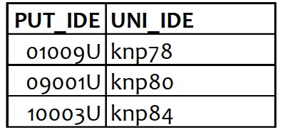

*Tabel 13 - Gecompartimenteerde putten*  
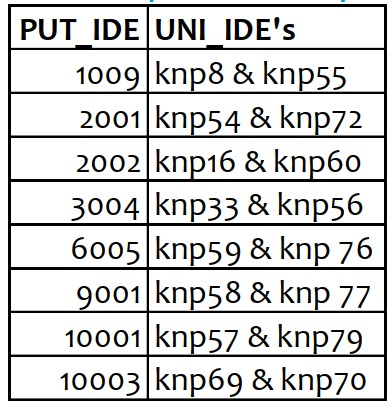

### Verbindingen
Het testbestand bestaat uit 96 verbindingen, waaronder 75 gesloten leidingen (gemengd, vuilwater en hemelwater), 1 open water verbinding (lei79), 4 IT-leidingen (lei75, lei76, lei77 en lei78), 8 pompen, 2 doorlaten en 6 overstortdrempels. Op één locatie is er dubbele verbinding tussen twee putten (pmp93 en pmp94). Van elke verbinding staat in VERBINDING.CSV
beschreven tussen welke knooppunten deze is en wat voor een verbinding dit is, inclusief eventuele dimensies en materialen

### Kunstwerken
Sommige knooppunten en verbindingen zijn kunstwerken. De kunstwerken staan beschreven in KUNSTWERK.CSV. Het testbestand bevat de volgende uitlaten (Tabel 14), doorlaten (Tabel 15), overstorten (Tabel 16) en pompen (Tabel 17):

*Tabel 14 - Uitlaten*  
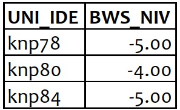

*Tabel 15 - Doorlaten*  
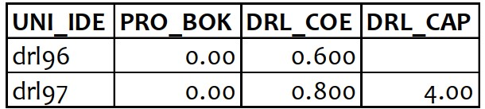

*Tabel 16 - Overstorten*  
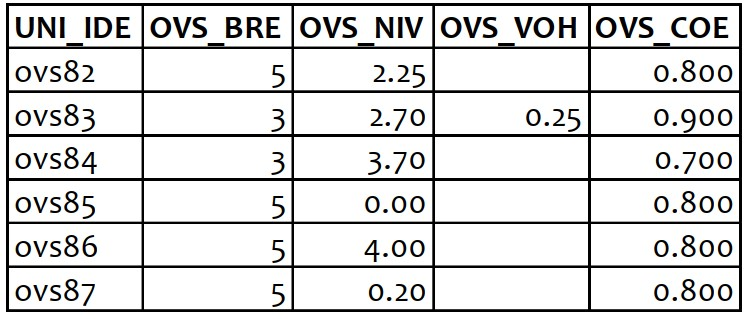

*Tabel 17 - Pompen*  
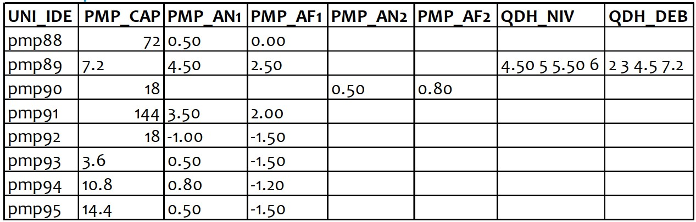

Eén doorlaat (drl97) is begrenst met een maximale capaciteit. Eén overstort (ovs83) heeft een maximaal overstortende
straal. Eén pomp (pmp89) voert conform een Qh-relatie af. De afvoer van één pomp (pmp90) wordt bepaald door de
bovenstroomse waterstand.

### Profiel
Bij bepaalde verbindingen, zoals gesloten leidingen, open water, IT-leidingen en doorlaten, staat in het veld PRO_IDE een verwijzing naar de profieldefinitie. De profieldefinitie staat beschreven in PROFIEL.CSV. Naast een groot aantal standaardleidingen voor de riolering (PVC/beton – rond/eivorming – meerdere afmetingen),
bevat het testbestand ook een aantal afwijkende profielen (Tabel 18).

*Tabel 18 - Profielen*  
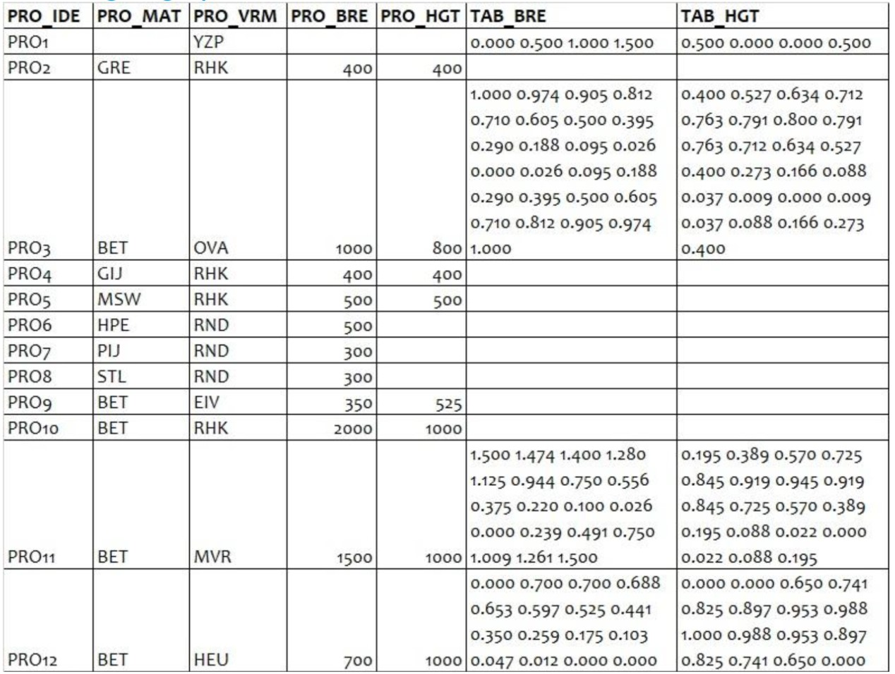

### Infiltratieobjecten
Sommige knooppunten en verbindingen zijn infiltratieobjecten. Dan staat in het veld ITO_IDE een verwijzing naar de infiltratiedefinitie. De infiltratiedefinitie staat beschreven in ITOBJECT.CSV (Tabel 19).

*Tabel 19 - Infiltratiedefinities*  
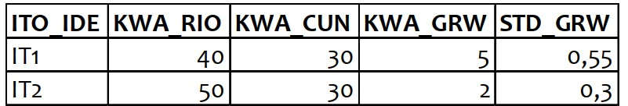

Van de verbindingen zijn lei75, lei76, lei77 en lei78 infiltratieleidingen, met infiltratiedefinitie IT1.
Van de knooppunten is knp67 (put 07005) een infiltratieput, met infiltratiedefinitie IT2.

### Belasting
De knooppunten en verbindingen van de rioolstelsels van het testbestand worden hydraulisch belast door afvoerend oppervlak en door vuilwater en lateraal debiet. 
Voor de belasting door afvoerend oppervlak (beschreven in OPPERVLAK.CSV) wordt in het testbestand enkel het NWRW neerslag-afvoerconcept gebruikt. In totaal is er 61.500 m2 oppervlak op het stelsel aangesloten dan inloopt via het NWRW-inloopmodel. 
In het testbestand ontvangen 6 knooppunten een belasting met vuilwater (VWD), waarvan er 5 het verloop van “Bedrijf” hebben en 1 het verloop van “Inwoner” heeft. In het testbestand ontvangen 63 verbindingen een belasting met vuilwater (VWD), waarvan er 57 het verloop van “Bedrijf” hebben , 2 het verloop van “Inwoner” hebben en 2 het verloop van “Kantoor” hebben. 
Er zijn 3 objecten, die een lateraal debiet ontvangen, waarvan er 2 (knp10 en lei4) een eigen verloop hebben en 1 (knp11) wordt bepaald door het aangesloten oppervlak (Tabel 20).

*Tabel 20 - Lateraal debiet*  
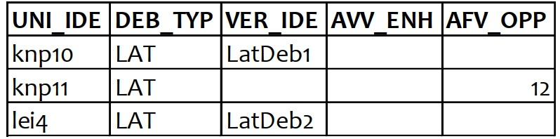

## Schematisatie in detail 
In Figuur 6 staat aangegeven welke delen van de schematisatie in deze paragraaf in meer detail worden getoond.

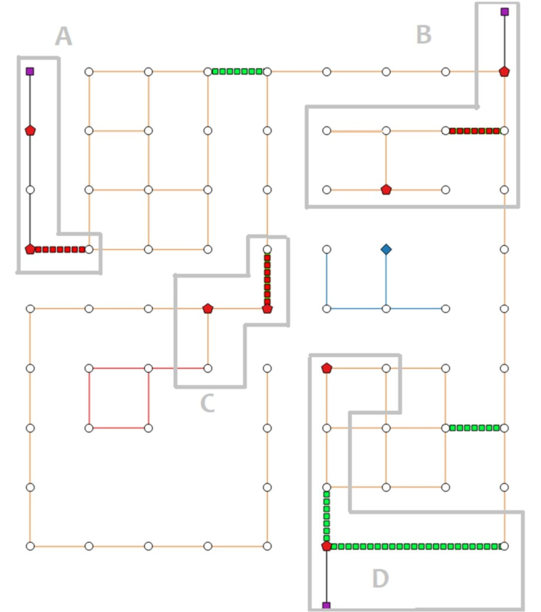

*Figuur 6 - Onderdelen van de schematisatie die in meer detail worden getoond* 

### Detail A
In detail A is een randvoorziening te zien, die via put 04006 (knp43) met de rest van het stelsel (niet te zien) is verbonden. Vanuit put 04006 stroomt het water via lei66 in het eerste compartiment (knp57) van de gecompartimenteerde put 10001 in. Daar gaat het via de overstortdrempel (ovs85) naar het andere compartiment (knp79) van put 10001. Van daar stroomt het de bergbezinkleiding in (lei80, knp68, lei81) en komt het uit in het eerste compartiment (knp69) van put 10003. Via de overstortdrempel (ovs87) komt het water in het andere compartiment (knp70) van put 10003. Vanuit daar stroomt het water via lei79 naar de uitlaat (knp84/put 10003U), want de rand van het model is. De groene sterren geven aan waar de kunstwerken zitten, die zijn beschreven in KUNSTWERK.CSV.

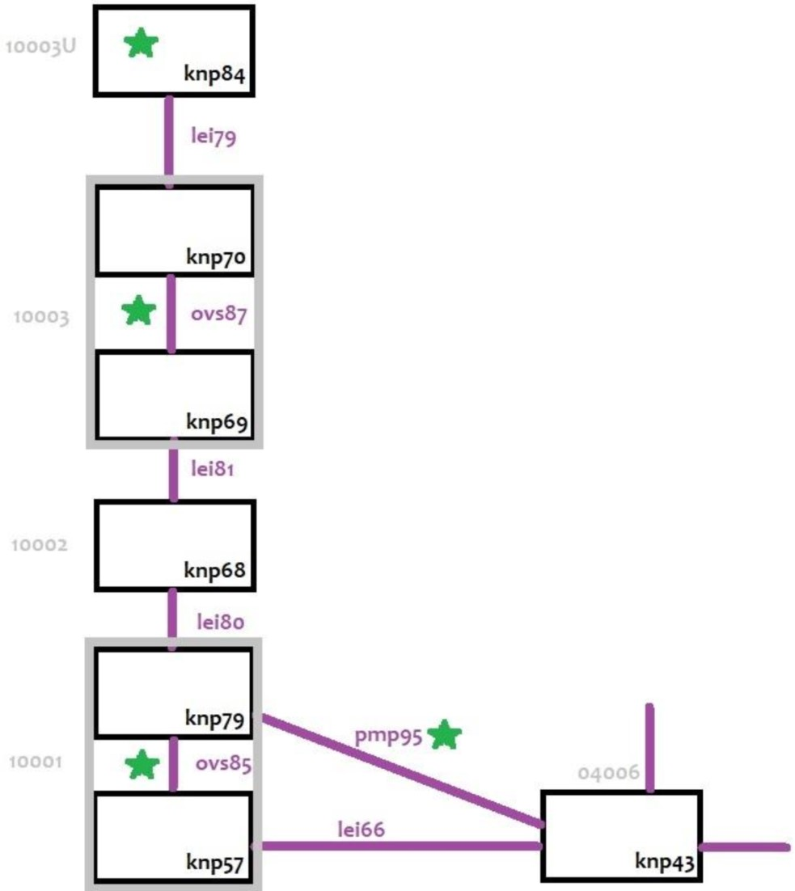

*Figuur 7 - Detail A* 

### Detail B
In detail B zijn twee gecompartimenteerde putten te zien, waarvan de ene (01009) een verbinding tussen de compartimenten heeft in de vorm van een overstortdrempel (ovs83) en de andere (06005) een verbinding tussen de compartimenten heeft in de vorm van een doorlaat (drl96). Tussen put 06001 (knp75) en put 01008 (knp7) zitten twee verbindingen. Beide zijn pompen (pmp93 en pmp94). De groene sterren geven aan waar de kunstwerken zitten, die zijn beschreven in KUNSTWERK.CSV.

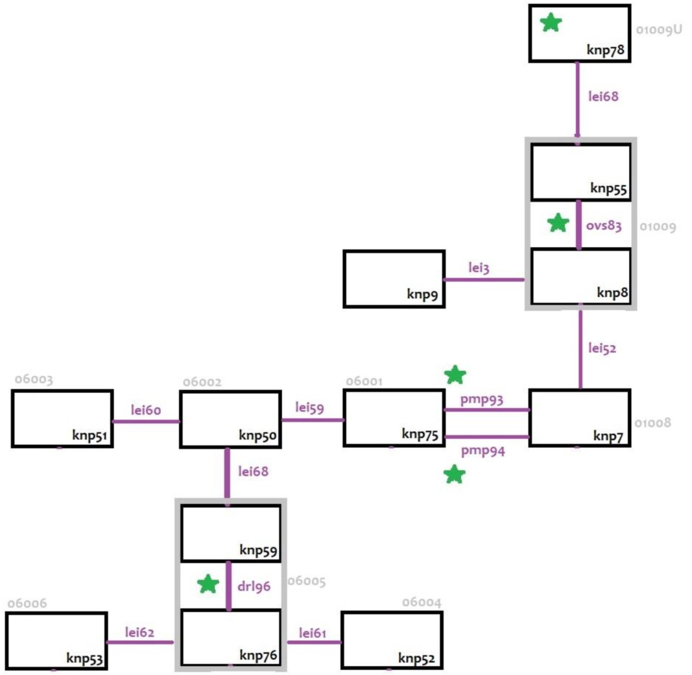

*Figuur 8 - Detail B* 

### Detail C
In detail C zijn twee gecompartimenteerde putten te zien, waarvan de ene (02001) een verbinding tussen de compartimenten heeft in de vorm van een overstortdrempel (ovs82) en de andere (02002) een verbinding tussen de compartimenten heeft in de vorm van een doorlaat (drl97). Tussen put 02001 en put 01016 (knp15) zitten twee verbindingen. De ene verbinding is een pomp (pmp88) welke het ene compartiment (knp72) van put 02001 leegpompt naar put 01016 (knp15). De andere verbinding is een leiding (lei63) die tussen het andere compartiment (knp54) van put 02001 en put 01016 (knp15) ligt. De groene sterren geven aan waar de kunstwerken zitten, die zijn beschreven in KUNSTWERK.CSV.

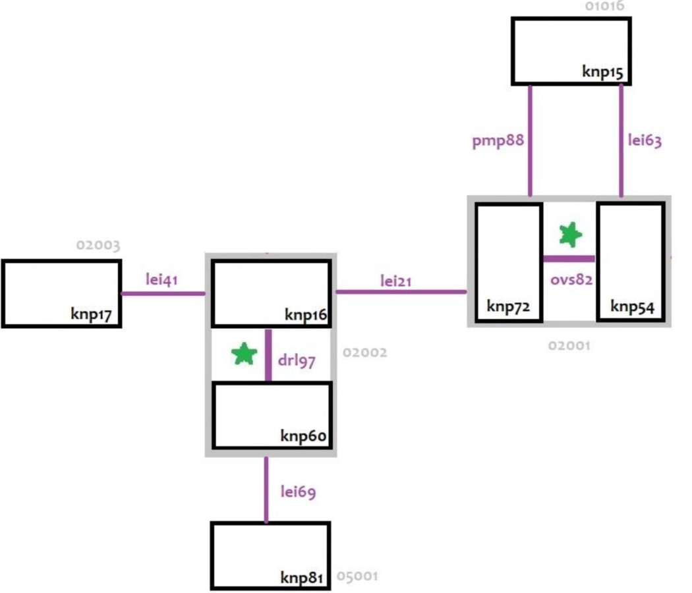

*Figuur 9 - Detail C* 

### Detail D
In detail D zijn twee gecompartimenteerde putten te zien (03004 en 09001), met beide een verbinding tussen de compartimenten in de vorm van een overstortdrempel (ovs84 en ovs86). Er zijn twee pompen (pmp89 en pmp91) die beide verbonden zijn met hetzelfde compartiment (knp77) van put 09001. De groene sterren geven aan waar de kunstwerken zitten, die zijn beschreven in KUNSTWERK.CSV.

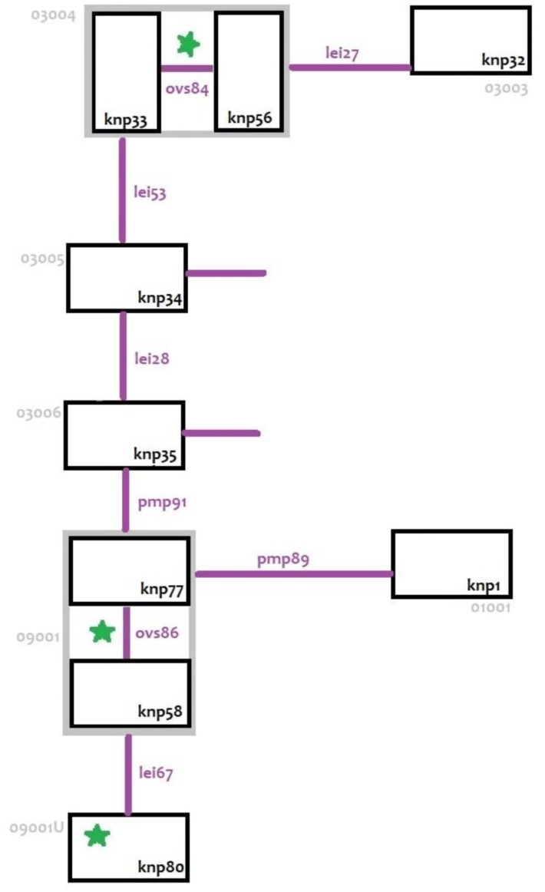

*Figuur 10 - Detail D* 

# HydX-download

Deze paragraaf beschrijft de werking van de HydX-download met GWSW-Apps.

De basis voor deze applicaties vormen de queries op https://github.com/StichtingRIONED/gwsw_queries/blob/main/apps/Hyd . 
Deze queries lezen de relevante gegevens uit de GWSW-Datasets. 
Om deze SPARQL-queries (met extensie .rq) te kunnen lezen is enige kennis van SPARQL nodig. Inzicht in de werking van deze queries is 
noodzakelijk om de werking van de HydX-download in de basis te begrijpen. 
Deze paragraaf licht alleen de aanvullende bewerkingen van de query-resultaten toe.

## Coderingen in het HydX

De GWSW-aanduidingen voor vorm leiding, vorm put, materiaal leiding, enzovoort worden in de HydX-download omgezet naar de HydX-coderingen.
Voor deze omzetting wordt het deelmodel HydX gebruikt met daarin alle specificaties (voor de SPARQL-kenners, via de query op [HydX_collection.rq](https://github.com/StichtingRIONED/gwsw_queries/blob/main/apps/Hyd/HydX_Collection.rq)).

In het deelmodel HydX zijn alle vertalingen van GWSW-aanduidingen naar HydX-coderingen opgenomen.
Zie bijvoorbeeld de collectie voor materiaal leiding op https://data.gwsw.nl/MateriaalLeidingColl, voor de gangbare leidingmaterialen is een bijbehorende HydX-code gedefinieerd.

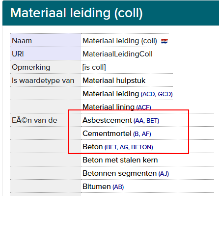 

Dit voorbeeld toont dat voor asbestcement (https://data.gwsw.nl/Asbestcement) dezelfde code als voor beton wordt gebruikt (BET). 

## Knooppunten
Voor de SPARQL-kenners, zie ook de query op [Hyd_Knooppunt.rq](https://github.com/StichtingRIONED/gwsw_queries/blob/main/apps/Hyd/Hyd_Knooppunt.rq) 

### Compartimenten
Compartimenten worden als knooppunten meegenomen. Voor elk compartiment in de dataset zijn gegevens zoals afmetingen nodig.

De volgende gegevens van compartimenten worden - zo nodig - wel overgenomen van het compositie-object (de put of het bouwwerk waarin het compartiment zich bevindt):
- Materiaal
- Maaiveldschematisering
- Bergend oppervlak
- Hoogte (vanaf GWSW versie 1.6 bestaat het kenmerk HoogteCompartiment. Dit gegeven wordt bij voorkeur gebruikt.)

Het bergend oppervlak werd in eerdere versies zonder bewerking overgenomen van het compositie-object. 
Vanaf 14 augustus 2024 wordt het bergend oppervlak evenredig verdeeld over het aantal compartimenten in het compositie-object.

### Hulpstukken
In een rioleringsnetwerk kunnen aansluitpunten en hulpstukken voorkomen. Denk hierbij bijvoorbeeld aan uitlaatpunten, verbindingsstukken (bochtstukken, verloopstukken) of afsluitstukken. In het HydX-formaat is voor deze items geen apart knooppunttype gereserveerd. Omdat ze hydraulisch wel relevant zijn voor de verbindingen in het netwerk, worden aansluitpunten en hulpstukken in de HydX-download gedefinieerd als een Inspectieput (code INS) met een geknevelde maaiveldschematisering (code KNV) en met minimale afmetingen (1x1x1 mm). Het is aan de modelleur om hier rekentechnisch wenselijke afmetingen aan te geven.

### Niveau binnenonderkant
Het HydX bevat in kolom KNP_BOK het niveau van de binnenonderkant knooppunt. Deze waarde wordt als volgt afgeleid:
- Als de punt-geometrie 3 dimensies heeft wordt de Z-waarde uit de geometrie gebruikt
- Anders, als het knooppunt een put, bouwwerk of compartiment is, wordt het gekoppelde maaiveldniveau verminderd met de knooppunt-hoogte

### Omgaan met blinde en verdekte put
De GWSW-types BlindePut en VerdektePut zijn in de dataset altijd extra (uitvoerings)typeringen. 

Daarnaast is altijd het functionele type (Inspectieput, Overstortput, ...) in de dataset aanwezig. 

Een blinde put wordt wel - als apart uitvoeringstype - meegenomen in de queries, zie https://github.com/StichtingRIONED/gwsw_queries/blob/main/apps/Hyd/Hyd_Knooppunt.rq . Het type BlindePut heeft namelijk effect op de maaiveldschematisering van het knooppunt. Die wordt "Gekneveld" (code KNV). 

Een verdekte put wordt niet - als apart uitvoeringstype - meegenomen in de queries, omdat de mate (massa) van verdekking onbekend is.

## Verbindingen

Zie ook de query op https://github.com/StichtingRIONED/gwsw_queries/blob/main/apps/Hyd/Hyd_Leiding.rq 

### Type inzameling

Het type Inzameling wordt op basis van het leidingtype afgeleid:

| URI Leidingtype            | Code | Opmerking                        |
|----------------------------|------|----------------------------------|
| GemengdRiool               | GMD  |                                  |
| Overstortleiding           | HWA  |                                  |
| Vuilwaterriool             | DWA  |                                  |
| Hemelwaterriool            | HWA  |                                  |
| Infiltratieriool           | HWA  | (20190430)                       |
| VrijvervalTransportleiding | NVT  | Gebruik het supertype (20190430) |
| OpenLeiding                | NVT  | Gebruik het supertype (20190430) |

### Type verbinding

Het type Verbinding wordt op basis van het leidingtype afgeleid:

| URI Leidingtype            | Code | Opmerking                        |
|----------------------------|------|----------------------------------|
| GemengdRiool               | GSL  |                                  |
| Overstortleiding           | GSL  |                                  |
| Vuilwaterriool             | GSL  |                                  |
| Hemelwaterriool            | GSL  |                                  |
| Infiltratieriool           | ITR  | (20190430)                       |
| DIT_riool                  | ITR  | (20240816)                       |
| VrijvervalTransportleiding | GSL  | Gebruik het supertype (20190430) |
| OpenLeiding                | OPL  | Gebruik het supertype (20190430) |

### Binnenmaat profiel

In het GWSW wordt de gangbare afmeting-maat voor leidingen gebruikt. 
Voor kunststof is die gangbare maat de buitendiameter, voor andere materialen is dat de binnendiameter.
Zie ook [https://data.gwsw.nl/DiameterLeiding](https://data.gwsw.nl/DiameterLeiding).

Voor het HydX wordt altijd de binnenmaat van het profiel gebruikt.

Bepaal het profiel bij kunststof leidingen:
* Leiding is van kunststof als de HydX-materiaalcode is PVC of HPE
  Bij kunsstof-leidingen is de doorsnede-afmeting (breedte, hoogte, diameter) altijd buitenwerks
  De binnenmaat (het profiel) wordt voor alle leidingvormen als volgt bepaald:

* het kenmerk Wanddikte is ingevuld: 
  de binnenmaat wordt [breedte/hoogte - 2*wanddikte]
  - geen Wanddikte, wel kenmerk SDR_waarde ingevuld
    de wanddikte wordt [breedte / sdr], de binnenmaat wordt [breedte/hoogte - 2*wanddikte]
  - geen Wanddikte en geen SDR_waarde ingevuld
    er wordt uitgegaan van SDR_waarde 41, zie verder hiervoor
